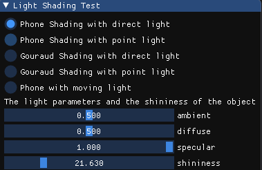

# HOMEWORK6 - Lights and Shading
---

## Basic
1. 实现Phone光照模型
+ 场景中绘制一个cube
+ 写shader实现两种shading:Phone Shading和Gouraud Shading，并解释两种shading的实现原理。
+ 合理设置视点、光照位置，光照颜色等参数，使光照效果明显显示。

2. 使用GUI，使参数可调节，效果实时更改：
+ GUI里可以切换两种shading
+ 使用如进度条这样的控件，使ambient因子、diffuse因子、specular因子、反光度shininess等参数可调节，光照效果实时更改。

## Result
立方体顶点坐标信息
```
float cube[] = {
        float cube[] = {
            // positions          // normals           // texture coords
            -0.5f, -0.5f, -0.5f,  0.0f,  0.0f, -1.0f,  0.0f,  0.0f,
            0.5f, -0.5f, -0.5f,  0.0f,  0.0f, -1.0f,  1.0f,  0.0f,
            0.5f,  0.5f, -0.5f,  0.0f,  0.0f, -1.0f,  1.0f,  1.0f,
            0.5f,  0.5f, -0.5f,  0.0f,  0.0f, -1.0f,  1.0f,  1.0f,
            -0.5f,  0.5f, -0.5f,  0.0f,  0.0f, -1.0f,  0.0f,  1.0f,
            -0.5f, -0.5f, -0.5f,  0.0f,  0.0f, -1.0f,  0.0f,  0.0f,

            -0.5f, -0.5f,  0.5f,  0.0f,  0.0f,  1.0f,  0.0f,  0.0f,
            0.5f, -0.5f,  0.5f,  0.0f,  0.0f,  1.0f,  1.0f,  0.0f,
            0.5f,  0.5f,  0.5f,  0.0f,  0.0f,  1.0f,  1.0f,  1.0f,
            0.5f,  0.5f,  0.5f,  0.0f,  0.0f,  1.0f,  1.0f,  1.0f,
            -0.5f,  0.5f,  0.5f,  0.0f,  0.0f,  1.0f,  0.0f,  1.0f,
            -0.5f, -0.5f,  0.5f,  0.0f,  0.0f,  1.0f,  0.0f,  0.0f,

            -0.5f,  0.5f,  0.5f, -1.0f,  0.0f,  0.0f,  1.0f,  0.0f,
            -0.5f,  0.5f, -0.5f, -1.0f,  0.0f,  0.0f,  1.0f,  1.0f,
            -0.5f, -0.5f, -0.5f, -1.0f,  0.0f,  0.0f,  0.0f,  1.0f,
            -0.5f, -0.5f, -0.5f, -1.0f,  0.0f,  0.0f,  0.0f,  1.0f,
            -0.5f, -0.5f,  0.5f, -1.0f,  0.0f,  0.0f,  0.0f,  0.0f,
            -0.5f,  0.5f,  0.5f, -1.0f,  0.0f,  0.0f,  1.0f,  0.0f,

            0.5f,  0.5f,  0.5f,  1.0f,  0.0f,  0.0f,  1.0f,  0.0f,
            0.5f,  0.5f, -0.5f,  1.0f,  0.0f,  0.0f,  1.0f,  1.0f,
            0.5f, -0.5f, -0.5f,  1.0f,  0.0f,  0.0f,  0.0f,  1.0f,
            0.5f, -0.5f, -0.5f,  1.0f,  0.0f,  0.0f,  0.0f,  1.0f,
            0.5f, -0.5f,  0.5f,  1.0f,  0.0f,  0.0f,  0.0f,  0.0f,
            0.5f,  0.5f,  0.5f,  1.0f,  0.0f,  0.0f,  1.0f,  0.0f,

            -0.5f, -0.5f, -0.5f,  0.0f, -1.0f,  0.0f,  0.0f,  1.0f,
            0.5f, -0.5f, -0.5f,  0.0f, -1.0f,  0.0f,  1.0f,  1.0f,
            0.5f, -0.5f,  0.5f,  0.0f, -1.0f,  0.0f,  1.0f,  0.0f,
            0.5f, -0.5f,  0.5f,  0.0f, -1.0f,  0.0f,  1.0f,  0.0f,
            -0.5f, -0.5f,  0.5f,  0.0f, -1.0f,  0.0f,  0.0f,  0.0f,
            -0.5f, -0.5f, -0.5f,  0.0f, -1.0f,  0.0f,  0.0f,  1.0f,

            -0.5f,  0.5f, -0.5f,  0.0f,  1.0f,  0.0f,  0.0f,  1.0f,
            0.5f,  0.5f, -0.5f,  0.0f,  1.0f,  0.0f,  1.0f,  1.0f,
            0.5f,  0.5f,  0.5f,  0.0f,  1.0f,  0.0f,  1.0f,  0.0f,
            0.5f,  0.5f,  0.5f,  0.0f,  1.0f,  0.0f,  1.0f,  0.0f,
            -0.5f,  0.5f,  0.5f,  0.0f,  1.0f,  0.0f,  0.0f,  0.0f,
            -0.5f,  0.5f, -0.5f,  0.0f,  1.0f,  0.0f,  0.0f,  1.0f
        };
	};
``` 

---

1. 实现Phone光照模型
+ 场景中绘制一个cube
+ 写shader实现两种shading:Phone Shading和Gouraud Shading，并解释两种shading的实现原理。
+ 合理设置视点、光照位置，光照颜色等参数，使光照效果明显显示。

#### 备注：为了使光照效果更明显，引入了一个球体。并实现了平行光与点光源两种光源模式，然而在该场景中，两种光源模式的显示效果看起来没有什么区别。

参数设置：
objectColor(0.0f, 0.5f, 0.2f)
light.Color(1.0f, 1.0f, 1.0f)
light.ambient(0.5, 0.5, 0.5)
light.diffuse(0.5, 0.5, 0.5)
light.specular(1.0, 1.0, 1.0)
shininess = 21.630
dirLight.direction(-0.6, -0.25, -0.647)
pointLight.lightPos(3.0, 3.0, 3.0)
viewPos(0.0f, 0.7f, 4.0f)
### Phone Shading结果截图
#### 平行光


#### 点光源


### Gouraud Shading结果截图
#### 平行光


#### 点光源


---

### 分析
Phone Shading的实现原理：
Phone光照模型在片段着色器中实现。Phone Shading的处理过程：在顶点着色器计算出顶点的法向量，然后将法向量传递给片段着色器，在片段着色器中，片段法向量是经过顶点法向量插值得到。
然后根据插值得到的法向量，对每一个片段应用Phone光照模型。

Gouraud Shading的实现原理：
Phone光照模型在顶点着色器中实现。Gouraud Shading的处理过程：在顶点着色器中对每个顶点应用Phone光照模型，计算出每个顶点颜色，并将顶点颜色传递给片段着色器。在片段着色器中，片段颜色是经过顶点颜色插值得到的。

两者的区别在于：Phone Shading，Phone光照模型在片段着色器中实现，Phone光照模型应用每个片段。Gouraud Shading，Phone光照模型在顶点着色器中实现,Phone光照模型只应用与每个顶点。

显示效果比较：
Phone Shading和Gouraud Shading，应用在立方体的显示效果差不多，不能明显地看出区别。而对于球体，可以明显地看出镜面反光显示的区别，Phone Shading的镜面反光效果比较平滑，而Gouraud Shading的镜面反光效果比较粗糙。这是因为Phone Shading的实现是将Phone光照模型应用于每个片段。

---
### Phone光照模型原理
Phone光照模型由环境光照，漫反射光照，镜面反射光照构成。
环境光照：光照不一定来自一个光源，有可能来自与其他物体的光照反射。在Phone模型，环境关照用了一个简化的全局照明模型，修改ambient值，改变环境光照的值。

漫反射光照：漫反射光照与物体法向量N和光到物体的向量S有关，当N,S向量的夹角越小，则漫反射光照的强度diffuse值越大。

镜面反射光照：镜面反射光照与 光到物体的反射光R和视角V以及物体的反光度有关。当物体反光度一定，R,V向量的夹角越小，则镜面反射光照的强度specular越大。而R,V向量的夹角一定，物体反光度Shininess值越小，镜面反射光照的强度specular越大。

---

### Phone光照模型Shader代码

```

struct DirLight {
    vec3 direction;
    vec3 lightColor;
    
    vec3 ambient;
    vec3 diffuse;
    vec3 specular;
};

struct PointLight {
    vec3 lightPos;
    vec3 lightColor;
    
    float constant;
    float linear;
    float quadratic;

    vec3 ambient;
    vec3 diffuse;
    vec3 specular;
};

in vec3 FragPos;
in vec3 Normal;


uniform vec3 objectColor;
uniform float shininess;
uniform vec3 viewPos;
uniform DirLight dirLight;
uniform PointLight pointLight;

vec3 CalcDirLight(DirLight light, vec3 normal, vec3 viewDir);
vec3 CalCPointLight(PointLight light, vec3 normal, vec3 viewDir);

void main()
{    
    vec3 norm = normalize(Normal);
    vec3 viewDir = normalize(viewPos - FragPos);
    vec3 result =  CalcDirLight(dirLight, norm, viewDir)+ CalCPointLight(pointLight, norm, viewDir);
    FragColor = vec4(result, 1.0);
}


vec3 CalcDirLight(DirLight light, vec3 normal, vec3 viewDir)
{

    vec3 lightDir = normalize(-light.direction);
    // diffuse shading
    float diff = max(dot(normal, lightDir), 0.0);
    // specular shading
    vec3 reflectDir = reflect(-lightDir, normal);
    float spec = pow(max(dot(viewDir, reflectDir), 0.0), shininess);
    // combine results
    vec3 ambient = light.ambient * light.lightColor;
    vec3 diffuse = light.diffuse * diff * light.lightColor;
    vec3 specular = light.specular * spec * light.lightColor;
    return (ambient + diffuse + specular) * objectColor;
}

vec3 CalCPointLight(PointLight light, vec3 normal, vec3 viewDir)
{
    vec3 lightDir = normalize(light.lightPos - FragPos);
     // diffuse shading
    float diff = max(dot(normal, lightDir), 0.0);
    // specular shading
    vec3 reflectDir = reflect(-lightDir, normal);
    float spec = pow(max(dot(viewDir, reflectDir), 0.0), shininess);
    // calculation distance
    float distance = length(light.lightPos - FragPos);
    float attenuation = 1.0 / (light.constant + light.linear * distance + light.quadratic * (distance * distance));    
    // combine results
    vec3 ambient = light.ambient * light.lightColor;
    vec3 diffuse = light.diffuse * diff * light.lightColor;
    vec3 specular = light.specular * spec * light.lightColor;
    // ambient  *= attenuation; 
    // diffuse  *= attenuation;
    // specular *= attenuation;

    vec3 result = (ambient + diffuse + specular) * objectColor;

    return result;
}
```
---


2. 使用GUI，使参数可调节，效果实时更改：
+ GUI里可以切换两种shading
+ 使用如进度条这样的控件，使ambient因子、diffuse因子、specular因子、反光度shininess等参数可调节，光照效果实时更改。

#### GUI菜单栏截图


(具体效果请看doc文件夹下gif文件)

#### 实现思路
GUI菜单栏有5种模式：
##### Phone Shading模式
1. Phone Shading with Direct Light(平行光)
2. Phone Shading with Point Light(点光源)
##### Gouraud Shading模式
3. Gouraud Shading with Direct Light(平行光)
4. Gouraud Shading with Point Light(点光源)
#####
5. Phone Shading with moving Light(点光源)

参数设置：
有4个Slider分别设置光的参数ambient，diffuse，specular以及物体的反光度shininess
平行光模式下，可以设置光的方向向量
点光源模式下，可以设置光的位置向量


---
## Bonus
使光源在场景中来回移动，光照效果实时更改

### 截图

(动画效果请看doc文件夹下的gif文件)

### 实现思路
随着时间的变化，改变光源的位置。使光源沿着某一个圆上移动。

#### 具体代码如下
```
    float radius = 5.0f;
    posZ = radius * cos(glfwGetTime());
    posX = radius * sin(glfwGetTime());
    posY = 0;
    //set light position

```
