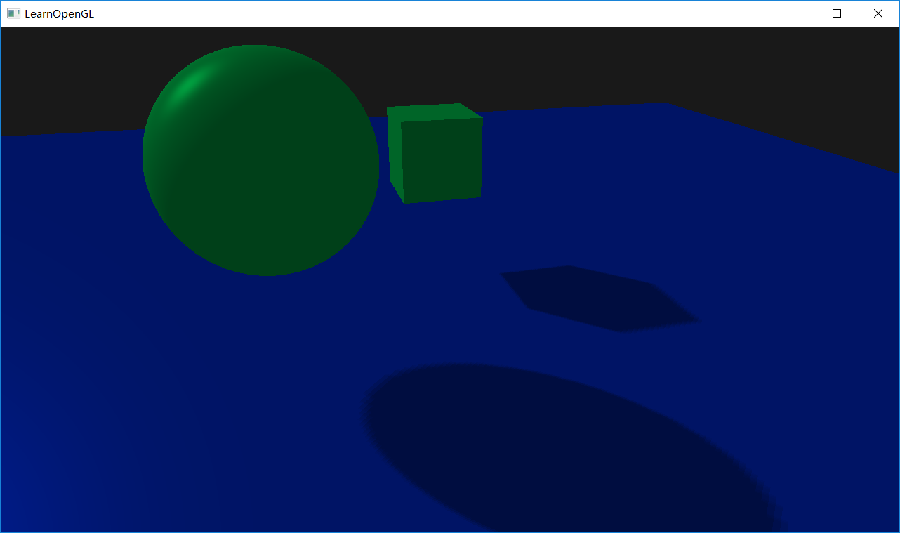
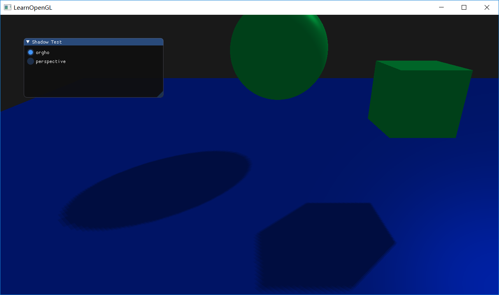
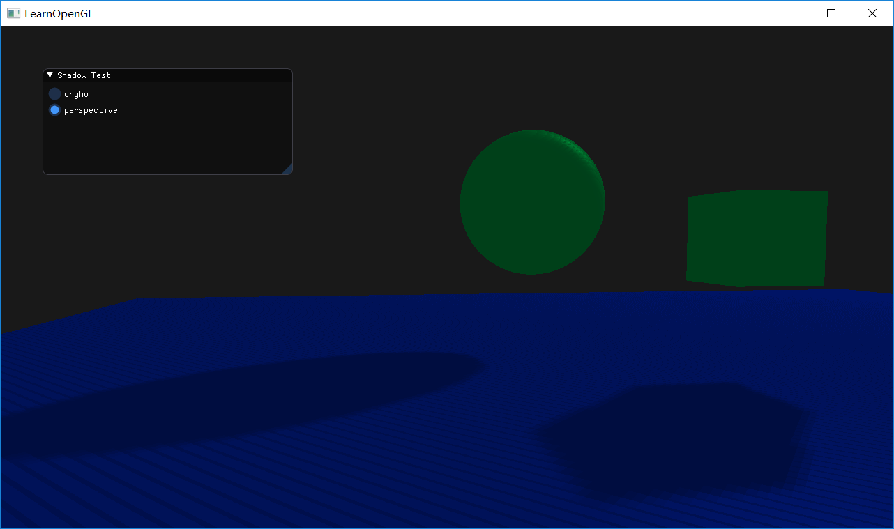
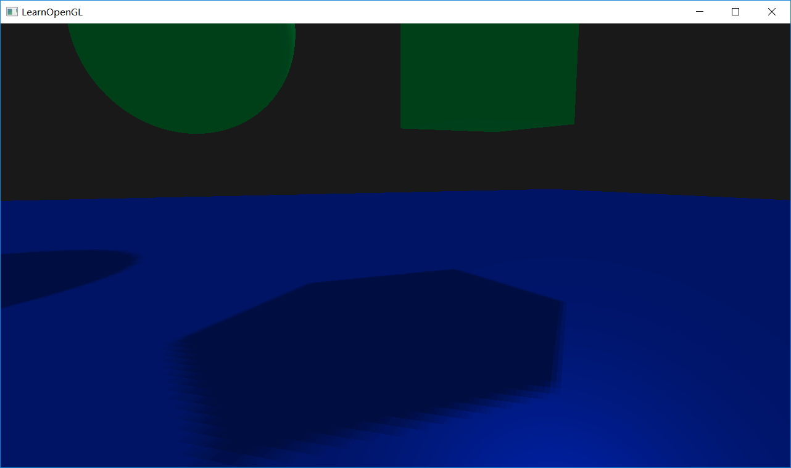

# HOMEWORK7 - Shadowing Mapping
---

## Basic
1. 实现方向光源的Shadowing Mapping
+ 要求场景中至少有一个object和一块平面（用于shadow）
+ 光源的投影方式任选其一
+ 在报告中结合代码，解释Shadowing Mapping算法
2. 修改GUI

## Result
1. 实现方向光源的Shadowing Mapping
+ 要求场景中至少有一个object和一块平面（用于shadow）
+ 光源的投影方式任选其一
+ 在报告中结合代码，解释Shadowing Mapping算法

### 结果截图：


### Shadow Mapping算法
第一步，新建帧缓冲，其中该帧缓冲只有深度缓冲，用于从光的位置的视野下渲染场景时生成深度纹理贴图。
```
    //create frame buffer
	void createFrameBuffer() {
		glGenFramebuffers(1, &depthMapFBO);
		// create depth texture
		glGenTextures(1, &depthMap);
		glBindTexture(GL_TEXTURE_2D, depthMap);
		glTexImage2D(GL_TEXTURE_2D, 0, GL_DEPTH_COMPONENT, SCR_WIDTH, SCR_HEIGHT, 0, GL_DEPTH_COMPONENT, GL_FLOAT, NULL);
		glTexParameteri(GL_TEXTURE_2D, GL_TEXTURE_MIN_FILTER, GL_NEAREST);
		glTexParameteri(GL_TEXTURE_2D, GL_TEXTURE_MAG_FILTER, GL_NEAREST);
		glTexParameteri(GL_TEXTURE_2D, GL_TEXTURE_WRAP_S, GL_REPEAT);
		glTexParameteri(GL_TEXTURE_2D, GL_TEXTURE_WRAP_T, GL_REPEAT);
		glTexParameteri(GL_TEXTURE_2D, GL_TEXTURE_WRAP_S, GL_CLAMP_TO_BORDER);
		glTexParameteri(GL_TEXTURE_2D, GL_TEXTURE_WRAP_T, GL_CLAMP_TO_BORDER);
		GLfloat borderColor[] = { 1.0, 1.0, 1.0, 1.0 };
		glTexParameterfv(GL_TEXTURE_2D, GL_TEXTURE_BORDER_COLOR, borderColor);
		// attach depth texture as FBO's depth buffer
		glBindFramebuffer(GL_FRAMEBUFFER, depthMapFBO);
		glFramebufferTexture2D(GL_FRAMEBUFFER, GL_DEPTH_ATTACHMENT, GL_TEXTURE_2D, depthMap, 0);
		glDrawBuffer(GL_NONE);
		glReadBuffer(GL_NONE);
		glBindFramebuffer(GL_FRAMEBUFFER, 0);
	}
```
---

第二步
绑定第一步生成的帧缓冲，从光的位置的视野下使用了正交投影和视图矩阵来渲染场景，对深度缓冲进行写入，然后生成深度纹理贴图。
首先构造视图矩阵，该视图矩阵将世界坐标转换为光源视角可见的坐标空间。（备注：方向光源，可以视为无限远的点光源位置）
因此创建视图矩阵，设比较远光源位置，光源方向指向原点。
然后构建投影矩阵，因为使用平行光，因此为光源使用正交投影矩阵，这样使得透视图不会有变形。合理设置near_plane,far_plane将平截头体包含所有渲染得到物体。
将视图矩阵与投影矩阵相乘构建出光空间的转换矩阵。
```
    glEnable(GL_DEPTH_TEST);
    //bind the depth map frame buffer and render the depth map texture
    glBindFramebuffer(GL_FRAMEBUFFER, depthMapFBO);
    glViewport(0, 0, SCR_WIDTH, SCR_HEIGHT);
    glClear(GL_DEPTH_BUFFER_BIT);

    glm::mat4 lightProjection, lightView;
    glm::mat4 lightSpaceMatrix;
    float near_plane = 0.1f, far_plane = 100.0f;
    lightProjection = glm::ortho(-10.0f, 10.0f, -10.0f, 10.0f, near_plane, far_plane);
    lightView = glm::lookAt(lightPos, glm::vec3(0.0f), glm::vec3(0.0, 1.0, 0.0));
    depthShader.use();
    depthShader.setMat4("lightSpaceMatrix", lightSpaceMatrix);
    renderScene(depthShader);
```
---

第三步
绑定默认的帧缓冲，根据第二步得到光空间转换矩阵与深度纹理贴图从摄像机的位置视野下渲染场景。
顶点着色器，根据顶点数据，光空间转换矩阵，将顶点坐标转换为光空间的坐标系统。
根据顶底啊数据，与摄像机摄图矩阵，投影矩阵，转换矩阵将顶点坐标转换为屏幕坐标和世界坐标，并计算出在世界坐标系下对应顶点法向量。

```
//顶点着色器部分代码
uniform mat4 lightSpaceMatrix;
uniform mat4 model;
uniform mat4 view;
uniform mat4 projection;


void main()
{
    FragPos = vec3(model * vec4(aPos, 1.0));
    Normal = transpose(inverse(mat3(model))) * aNormal;
    FragPosLightSpace = lightSpaceMatrix * model * vec4(aPos, 1.0f);
    gl_Position = projection * view * model * vec4(aPos, 1.0f);
    
}
```
片段着色器，根据深度纹理贴图与光空间顶点坐标获取该片段在光源视角的深度值以及最近点的深度值，
将该片段的深度值Z1与最近点的深度值Z0进行比较，若Z0 < Z1,则该片段处于阴影处，只赋予该片段环境光。若Z0 > Z1,则片段不处于阴影处，根据Phone光照模型算法，计算出该片段的像素值。
以下为片段着色器部分代码
ShadowCalculation函数计算片段是否处于阴影处，返回shadow值。shadow == 1，处于影响。
CalcDirLight函数利用Phone光照模型，计算在平行光下片段的像素值。
主要代码 (ambient + (1.0 - shadow) * (diffuse + specular)) * objectColor;    
对shadow == 1，则赋予片段环境光，否则为Phone光照模型计算出的像素值。

```
//片段着色器
float ShadowCalculation(vec4 fragPosLightSpace, vec3 normal, vec3 lightDir)
{
    //执行透视除法
    vec3 projCoords = fragPosLightSpace.xyz / fragPosLightSpace.w;
    //将值映射到[0,1]处
    projCoords = projCoords * 0.5 + 0.5;
    /获取该片段在光源视角下的深度值
    float currentDepth = projCoords.z;
    //获取最近点的深度值
    float closestDepth = texture(shadowMap, projCoords.xy).r; 
    //阴影偏移
     float bias = max(0.05 * (1.0 - dot(normal, lightDir)), 0.005);
    // 检查当前片元是否在阴影中
    float shadow = currentDepth - bias > closestDepth  ? 1.0 : 0.0;

    if(projCoords.z > 1.0)
        shadow = 0.0;
    

    return shadow;
}


//Phone 光照模型
vec3 CalcDirLight(DirLight light, vec3 normal, vec3 viewDir)
{

    vec3 lightDir = normalize(-light.direction);
    // diffuse shading
    float diff = max(dot(normal, lightDir), 0.0);
    // specular shading
    vec3 reflectDir = reflect(-lightDir, normal);
    float spec = pow(max(dot(viewDir, reflectDir), 0.0), 32.0f);
    // combine results
    vec3 ambient = light.ambient * light.lightColor;
    vec3 diffuse = light.diffuse * diff * light.lightColor;
    vec3 specular = light.specular * spec * light.lightColor;

    float shadow = ShadowCalculation(FragPosLightSpace, normal, lightDir);   
    //计算像素值                   
    vec3 result = (ambient + (1.0 - shadow) * (diffuse + specular)) * objectColor;    
    return result;
}

```

---

## Bonus
### 透视投影与正交投影
添加GUI，
有两种模式
一种为正交投影
一种为透视投影。

#### 结果截图：
正交投影


透视投影（效果不好）



透视投影Shadow Mapping主要代码如下,
要将非深度值转换为线性深度值
```

float LinearizeDepth(float depth)
{
    float z = depth * 2.0 - 1.0; // Back to NDC 
    return (2.0 * near_plane * far_plane) / (far_plane + near_plane - z * (far_plane - near_plane));
}

float ShadowCalculation(vec4 fragPosLightSpace, vec3 normal, vec3 lightDir)
{
   
    vec3 projCoords = fragPosLightSpace.xyz / fragPosLightSpace.w;
    projCoords = projCoords * 0.5 + 0.5;
    float currentDepth = LinearizeDepth(projCoords.z);
    float bias = max(0.05 * (1.0 - dot(normal, lightDir)), 0.025);
   
    float shadow = 0.0;
    //阴影锯齿消除
    vec2 texelSize = 1.0 / textureSize(depthMap, 0);
    //均值滤波
    for(int x = -1; x <= 1; ++x)
    {
        for(int y = -1; y <= 1; ++y)
        {
            float pcfDepth = texture(depthMap, projCoords.xy + vec2(x, y) * texelSize).r; 
            pcfDepth = LinearizeDepth(pcfDepth);
            shadow += currentDepth - bias > pcfDepth ? 1.0 : 0.0;        
        }    
    }
    shadow /= 9.0;
    if(projCoords.z > 1.0)
        shadow = 0.0;
    

    return shadow;
}

```

### Shadow Mapping优化
PCF
核心思想是从深度贴图中多次采样，每一次采样的纹理坐标都稍有不同。每个独立的样本可能在也可能不再阴影中。所有的次生结果接着结合在一起，进行平均化，我们就得到了柔和阴影。
以下为PCF的代码,用3*3模板对应片段进行均值滤波操作。

```
  float shadow = 0.0;
    //阴影锯齿消除
    vec2 texelSize = 1.0 / textureSize(depthMap, 0);
    //均值滤波
    for(int x = -1; x <= 1; ++x)
    {
        for(int y = -1; y <= 1; ++y)
        {
            float pcfDepth = texture(depthMap, projCoords.xy + vec2(x, y) * texelSize).r; 
            shadow += currentDepth - bias > pcfDepth ? 1.0 : 0.0;        
        }    
    }
    shadow /= 9.0;
```


### 结果截图
