# HOMEWORK8 - Bezier Curve

学号：16340072 
姓名：何颢尧 
专业方向：数字媒体

---

## Basic
1. 用户能通过左键点击添加Bezier曲线的控制点，右键点击则对当前添加的最后一个控制点进行消除。
2. 工具根据鼠标绘制的控制点实时跟新Bezier曲线。

## Result
### 结果截图
鼠标左键点击任意三个位置
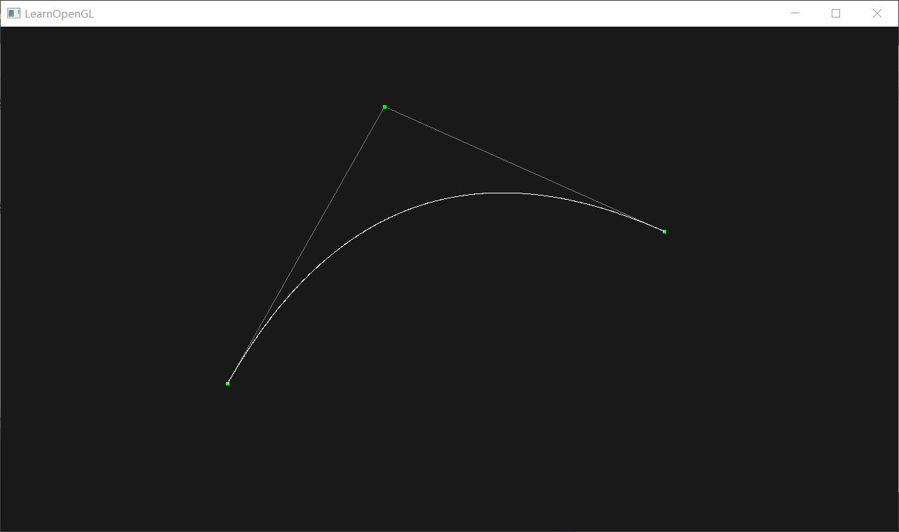

鼠标左键点击第四个位置
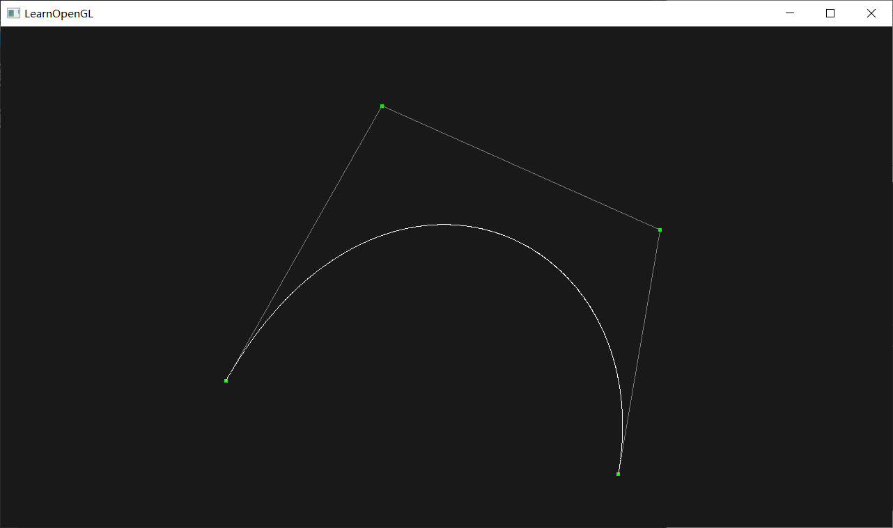

鼠标右键删除最后一个控制点
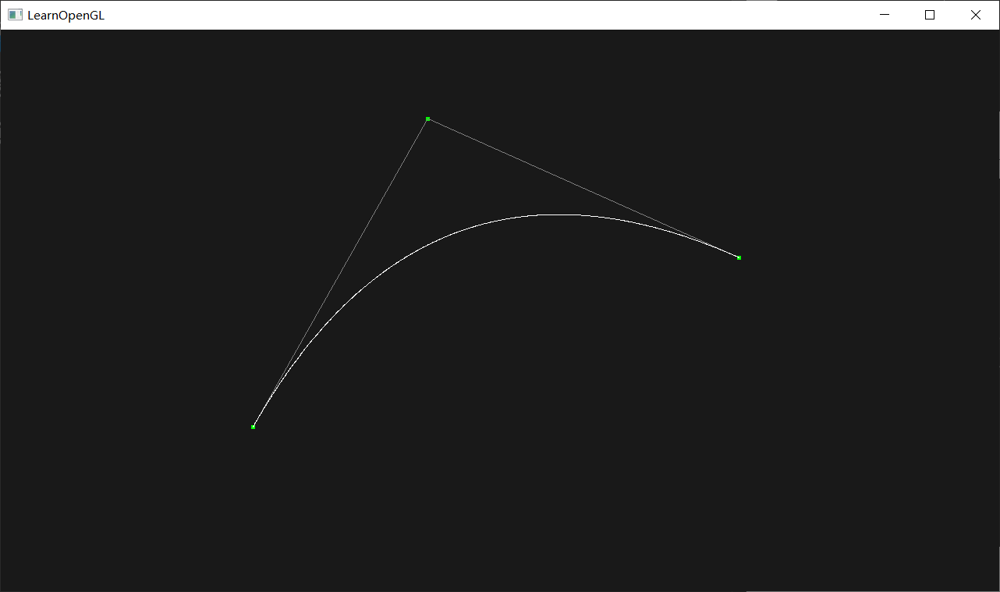


（动画效果请看.gif文件）

---


## Bezier曲线
Bezier curve本质上是由调和函数根据控制点插值生成，其参数方程如下
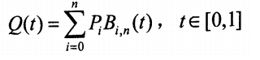

上式为n次多项式，具有n+1项。其中，Pi(i = 0,1,... n)表示特征多边形的n+1个顶点向量；B(t)为伯恩斯坦(Bernstein)基函数，其多项式表示为：
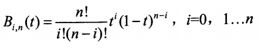

---

## 代码实现

### 鼠标点击与移动获取坐标位置

定义鼠标移动的回调函数，鼠标移动时，得出鼠标的位置坐标，xpos范围[0, SRC_WIDTH - 1], ypos范围[0, SRC_HEIGHT - 1]。要将xpos与ypos映射至[-1.0, 1.0]。
因为鼠标移动的回调函数获取的y坐标的坐标系与opengl画图的坐标系不同，因此需要对y坐标进行处理。

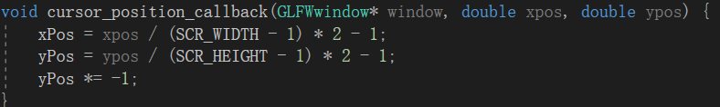

定义鼠标点击回调函数，
鼠标左键点击时，增加控制点。鼠标右键点击时，删除最后一个添加的控制点。

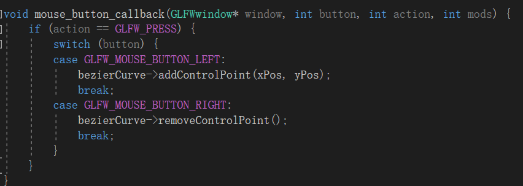

设置鼠标的回调函数

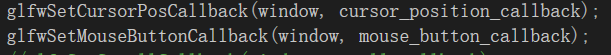

---

### 曲线点计算

一开始分别为曲线点与控制点新建一个足够大的缓冲区

注意glBufferData的第三个实参为NULL， 第四个实参为GL_DYNAMIC_DRAW,一开始时是没有控制点的，然后在后来添加控制点，才对缓冲区进行赋值。因为缓冲区的值会变，因此第四个参数需要为GL_DYNAMIC_DRAW。
顶点属性只有两个x坐标和y坐标

定义如下
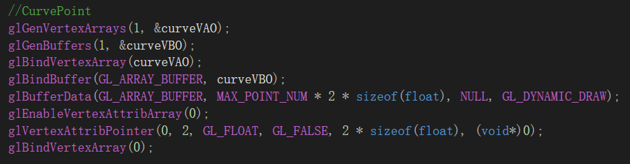

---

当每添加一个控制点或删除一个控制点时，都要重新计算曲线点
t范围[0, 1.0],为使Bezier曲线显示时比较连续，将dt取比较小的值。
计算完后，要曲线坐标信息赋予曲线点的顶点缓冲区中， 同时将新的控制点坐标信息赋予控制点的顶点缓冲区中。利用函数glBindSubData
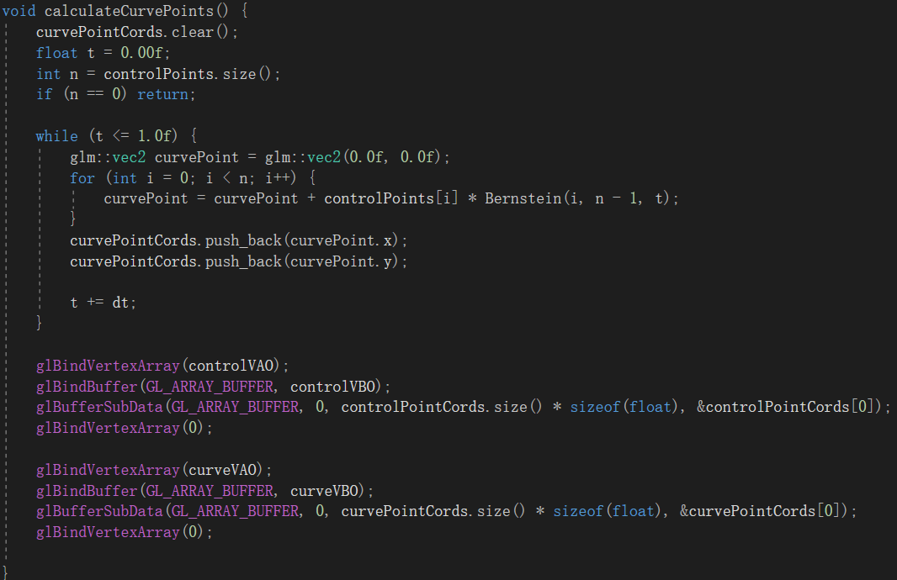

---


### 画曲线点与控制点

渲染时，只需要设置颜色，然后绑定对应缓冲对象，调用glDrawArrays,

可以使用glEnable(GL_POINT_SIZE)与函数glPointSize(size)，使控制点显示更大

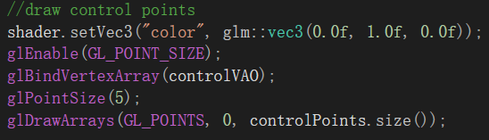

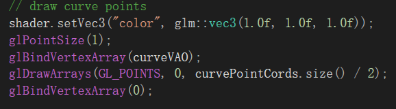
---


### 着色器代码
着色器代码非常简单
```
//顶点着色器
#version 330 core
layout (location = 0) in vec2 aPos;

void main()
{
    gl_Position = vec4(aPos.x, aPos.y, 0.0, 1.0); 
}  

//片段着色器
#version 330 core
out vec4 FragColor;

uniform vec3 color;
void main()
{             
   FragColor = vec4(color, 1.0);
}

```

---

## Bonus
1. 动态地呈现Bezier曲线的生成过程。

### Result
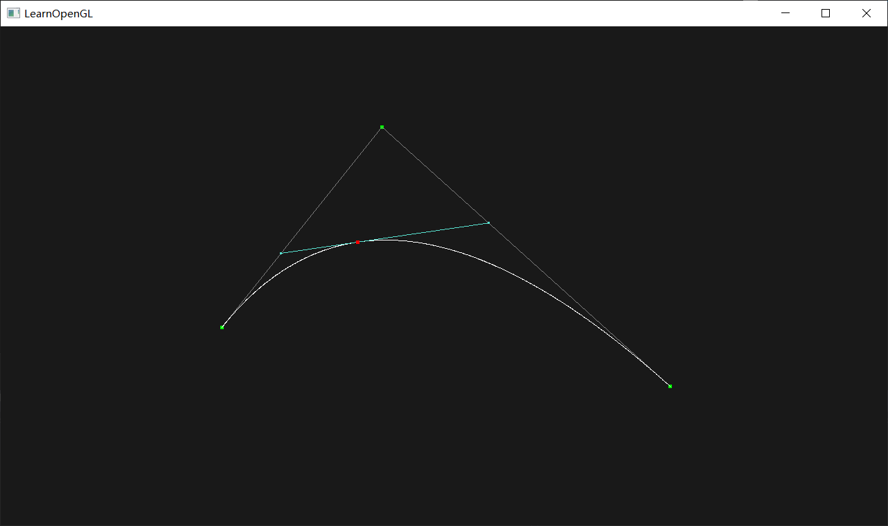

（动画效果请看.gif文件）


### 实现原理
请看下图
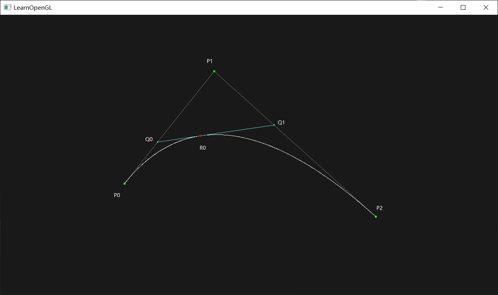

已知控制P0,P1,P2

当t = t0时

Q0 = (1 - t) * P0 + t * P1

Q1 = (1 - t) * P1 + t * P2


R0 = (1 - t) * Q0 + t * Q1


实现动态的曲线生成，随着t的变化，画出变化后Q0 Q1线段与R0点。


### 代码实现
在初始化时，随机生成MAX_CONTROL_POINT_NUM种颜色，在画线段时用到。
只有当控制点的数量大于2时，才有线段生成。当t = t0, 循环向下生成线段顶点，
画出线段顶点与线段，和对应的曲线点。
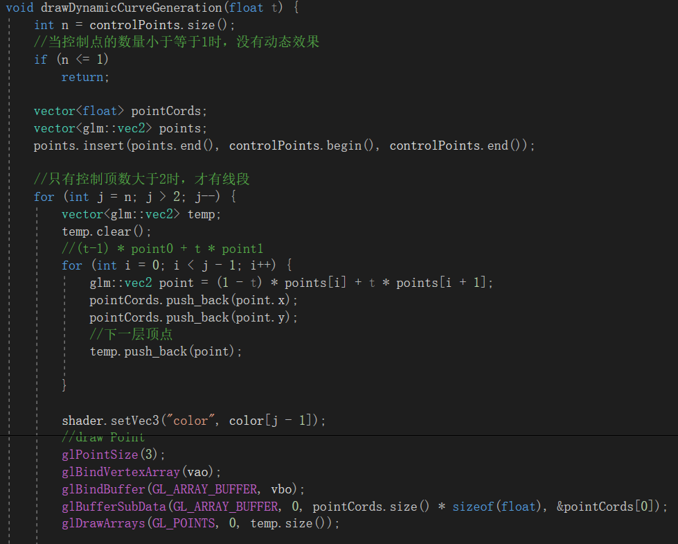
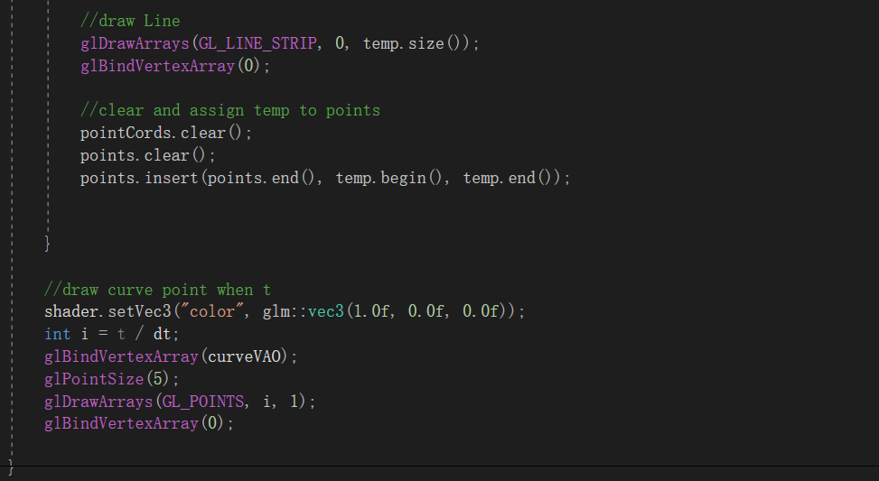

---

### 控制曲线生成的速度
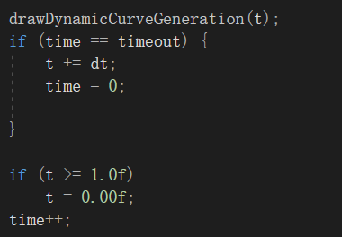